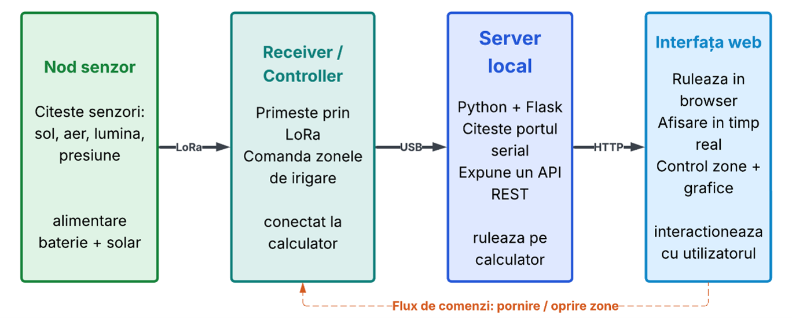
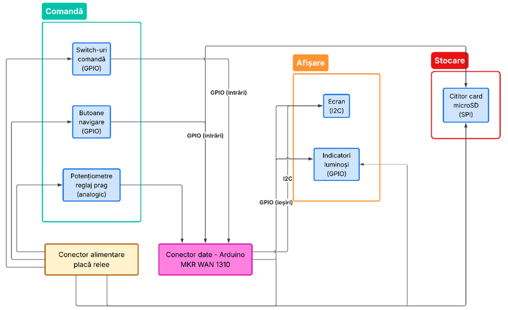
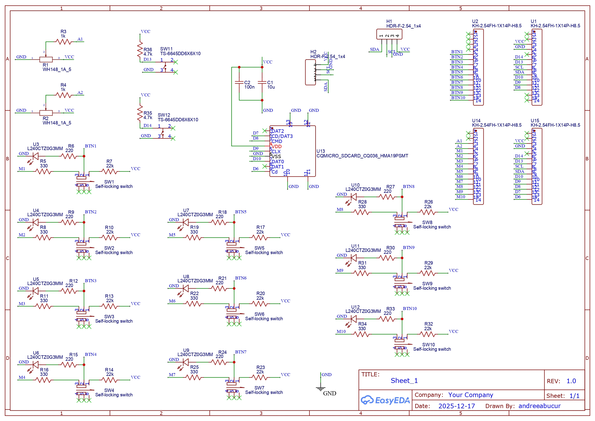
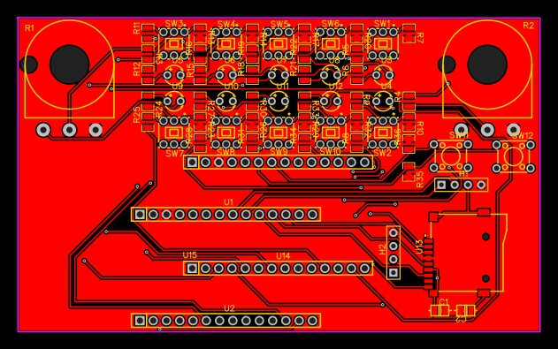
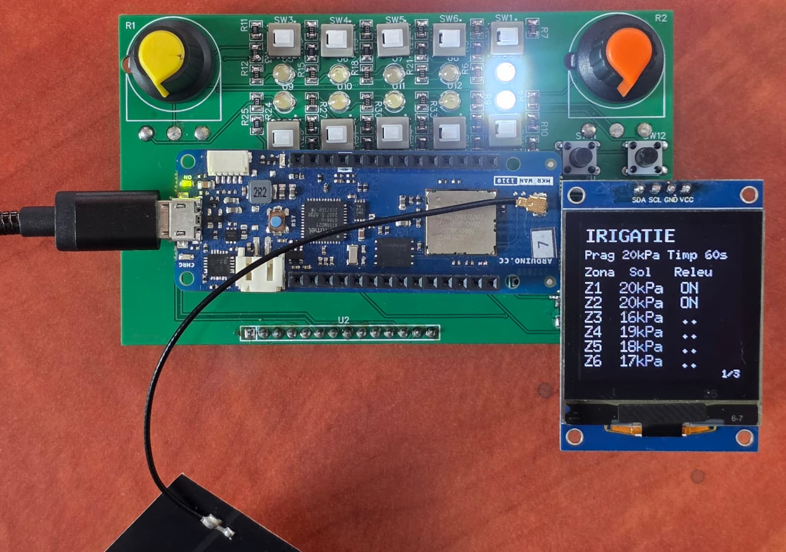
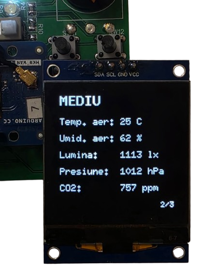
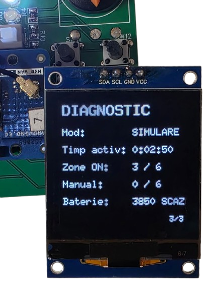
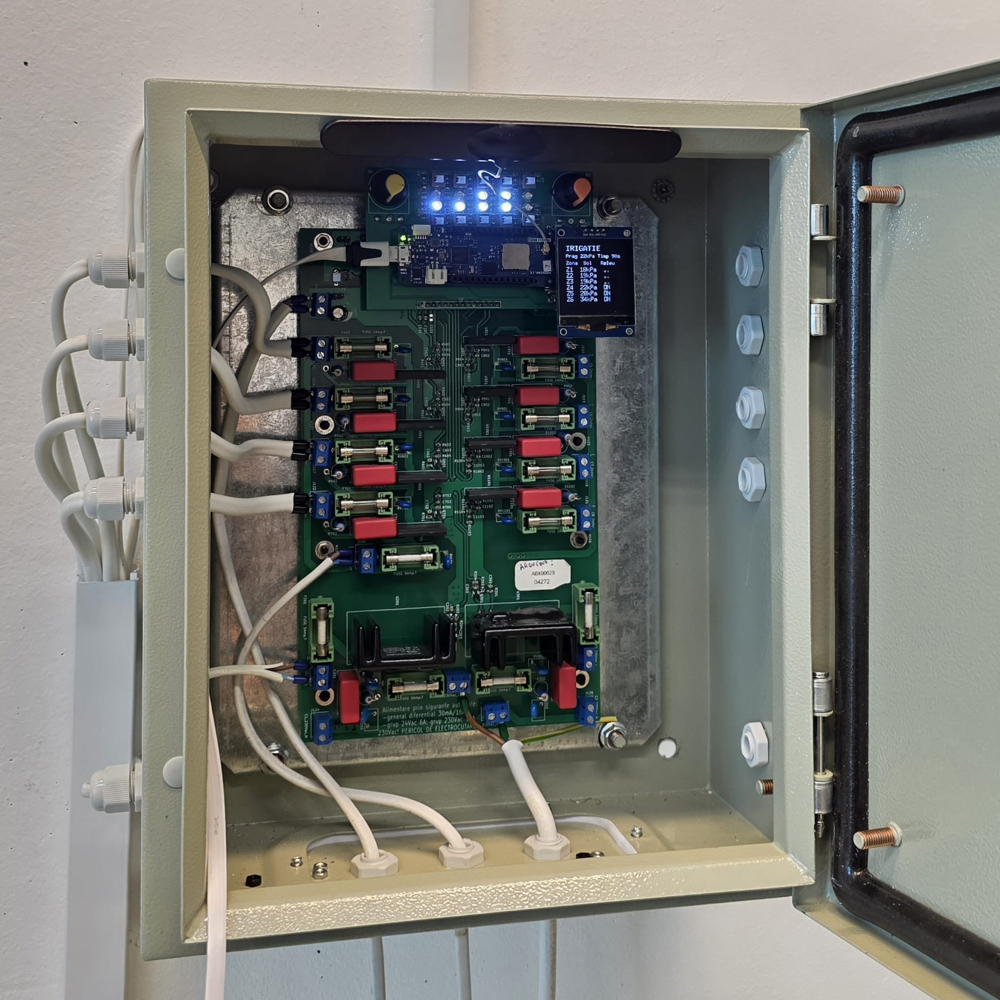
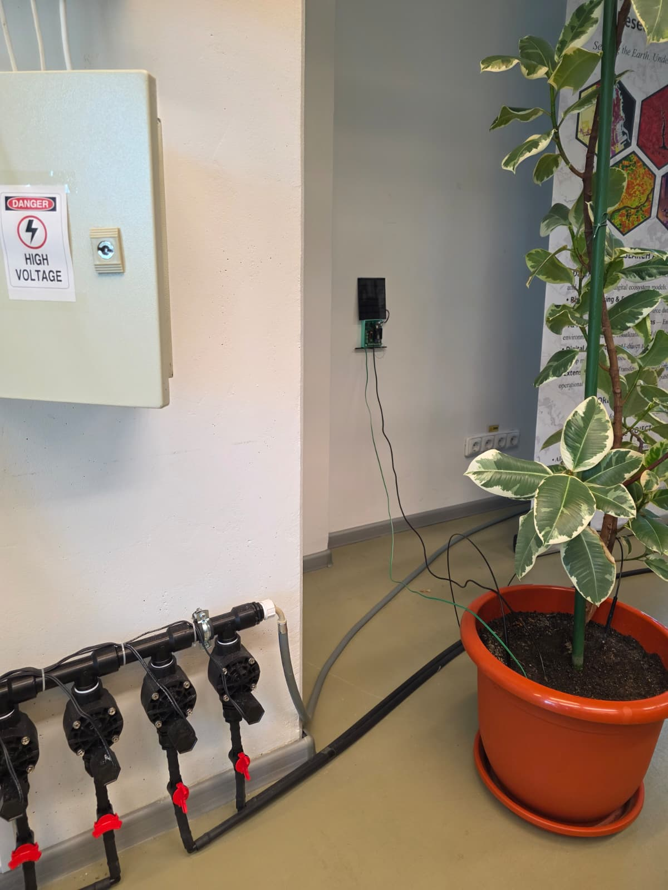

# HydraSmart — Local Monitoring & Control Interface for a LoRa Irrigation System

A monitoring and control interface for an automated irrigation system built around
**Arduino MKR WAN 1310** boards communicating over **LoRa**. The project adds a
local control panel (custom PCB with OLED, buttons, switches, potentiometers and a
microSD reader) and a **Flask + web** application, extending an existing irrigation
system without modifying its architecture.

## Overview

Water is a scarce resource, and traditional timer-based irrigation wastes it by
watering regardless of the actual soil state. Modern IoT solutions solve part of
this but often depend entirely on the internet and the cloud, becoming useless in
remote fields with poor connectivity. This project focuses on the part most such
systems neglect: a **local, autonomous interface** that lets the operator see the
system state and act directly in the field, without any external connection, while
still offering optional remote monitoring and control from a browser.

## Features

- **Soil-based automatic irrigation** across **6 independent zones**
- **Manual control** of each zone (On / Off / Auto) from the web interface
- **Real-time web dashboard**: zone status, environmental parameters, live charts
- **Local OLED interface** with 3 pages (Zones / Environment / Diagnostics)
- **Long-range wireless** sensor-to-controller link over **LoRa (868 MHz)**
- **Solar-powered sensor node** with deep-sleep operation and battery monitoring
- **Low-battery alert** on both the OLED and the web interface
- **Local data logging** to a microSD card
- **Simulation modes** (on the board and on the server) for demos without hardware
- **Robust by design**: irrigation keeps running even if the PC is disconnected

## System Architecture



The system has four parts linked in a chain: a **sensor node** in the field, a
**receiver / controller** that drives the irrigation zones, a **local server** running
on a PC, and a **web interface** in the browser.

- **Data flow** (field → user): the sensor node measures and transmits over LoRa;
  the actuator node applies the irrigation logic and forwards data over USB; the
  server reads the serial port and exposes a REST API; the browser polls it and
  updates the display.
- **Command flow** (user → field): a button press in the browser is sent to the
  server, forwarded over USB to the actuator node, which drives the corresponding
  zone — closing the monitoring-and-control loop.

## Hardware

| Component | Role |
|-----------|------|
| Arduino MKR WAN 1310 (×2) | Sensor node and actuator node (32-bit, integrated LoRa) |
| Watermark sensor | Soil moisture, as matric potential in **kPa** (currently installed) |
| SH1107 OLED (128×128, I²C) | Local display |
| 2× potentiometers | Set the moisture threshold and the watering duration |
| Switches / push-buttons | Local commands and OLED navigation |
| microSD reader (SPI) | Local data logging |
| Relays + fuses | Drive the electrovalves — 8× 24 VAC and 2× 230 VAC outputs |
| Solar panel + battery | Energy-autonomous sensor node |

> The sensor node is **designed** for a full environmental sensor set (soil/air
> temperature, air humidity, light, pressure, CO₂). At this stage only the Watermark
> soil-moisture sensor is physically fitted; the other values are demonstrative until
> the sensors are installed. The irrigation decision uses the real soil measurement.

### Control panel block diagram



The control panel is grouped into three functional blocks, all connected to the
MKR WAN 1310 through a single data connector:

- **Command** — self-locking switches and navigation buttons (digital GPIO inputs)
  and the two potentiometers for the threshold and watering time (analog inputs).
- **Display** — the OLED screen on I²C and the LED indicators for each output (GPIO).
- **Storage** — the microSD card reader on SPI.

The panel is powered from the relay board through a dedicated power connector.

### Circuit diagram




### PCB Design



The schematic was turned into a custom PCB. The layout follows how the panel is used:
the two potentiometers sit in the top corners, the switches and their LEDs form a
grid in the middle, the navigation buttons and the OLED header are on the right,
and the MKR WAN 1310 plugs into the headers in the lower half, next to the microSD
socket. This board replaces the original perfboard prototype.

## System in Action

The system is built and installed on a real irrigation setup: a custom control
panel mounted in an electrical enclosure, driving the zone electrovalves, with a
solar-powered sensor node reading soil moisture from a potted plant.

| Local control panel (Zones page) | Environment page | Diagnostics page |
|---|---|---|
|  |  |  |

| Controller installed in the enclosure | Full setup: valves, sensor node and plant |
|---|---|
|  |  |

## Firmware

The controller firmware is in **`Irrigation/Irrigation.ino`** and runs on the
actuator node (Arduino MKR WAN 1310).

**Requirements:** Arduino IDE with the *Arduino SAMD Boards* core and the libraries:

- [**U8g2**](https://github.com/olikraus/u8g2) — SH1107 OLED display;
- [**LoRa**](https://github.com/sandeepmistry/arduino-LoRa) (Sandeep Mistry) — only needed with `SIMULATE 0`;
- **SD** (built into the Arduino IDE) — only needed with `USE_SD 1`.

### Configuration

The behavior is selected with a few switches at the top of the sketch:

| Setting | Values | Effect |
|---------|--------|--------|
| `SIMULATE` | `0` / `1` | `0` = real data received over **LoRa** from the sensor node; `1` = data **generated on the board** (demo without field hardware) |
| `USE_SD` | `0` / `1` | `1` = log every received packet to the **microSD** card |
| `SD_CS_PIN` | `7` | chip-select pin of the microSD reader |
| `RELAY_ACTIVE_HIGH` | `true` / `false` | set to `false` if the relays close on a LOW signal |

> The repository version is set to `SIMULATE 0`. Without a running sensor node the
> OLED shows `--` for every zone — switch to `SIMULATE 1` for a demo.

### How it works

The controller reads the irrigation threshold (10–50 kPa) and watering time
(30–330 s) from the potentiometers, gets the sensor values for each zone — over
**LoRa** (868 MHz) or **simulated** on the board — and drives the 6 zones in
**AUTO**, **MANUAL ON** or **MANUAL OFF** mode. It updates the OLED pages and sends
all data to the PC over USB serial at **9600 baud**, optionally logging it to the
microSD card. Simulated data goes through the same processing path as real LoRa
packets, so the system behaves identically in both modes.

## Serial Data Format (actuator node → PC)

The controller writes several line types that the server recognizes:

| Line (example) | Meaning |
|----------------|---------|
| `1 28.0 18.5 24.3 55.2 1200.0 1013.0 4128` | zone data: `ID soil soilTemp airTemp airHum light pressure voltage [co2]` |
| `analogValue1 = 770 => irrigation_treshold = 30` | moisture threshold (kPa) |
| `analogValue2 = 600 => irrigation_time = 90` | watering duration (s) |
| `ON1` / `OFF1` … `ON6` / `OFF6` | relay state of a zone |
| `ZMODE 3 auto` \| `manon` \| `manoff` | zone mode |

> **About "soil moisture":** the value comes from the **Watermark** sensor and
> represents soil matric potential in **kPa** — a higher value means drier soil.
> A zone starts watering when the value **reaches or exceeds the threshold**.

## Getting Started

Requires **Python 3.9+**.

```bash
cd server
python -m venv .venv
# Windows:
.\.venv\Scripts\Activate.ps1
# Linux/macOS:
# source .venv/bin/activate
pip install -r requirements.txt
python app.py
```

Then open <http://127.0.0.1:5000> in a browser.

### Simulation mode (no hardware)

If no serial port is found, the server starts in **simulation mode** automatically.
To force it:

```bash
python app.py --simulate
```

### Connecting the real board

The server auto-detects the port. To set it manually (and the baud rate matches the
sketch: **9600**):

```bash
# Windows PowerShell
$env:IRRIG_PORT = "COM3"; python app.py
```

Available ports are listed at <http://127.0.0.1:5000/api/ports>.

> **Note:** only one program can use the serial port at a time — close the Arduino
> IDE *Serial Monitor* before starting the server.

## REST API

| Method | Route | Description |
|--------|-------|-------------|
| GET | `/api/state` | Full state (thresholds, zones, modes, node data) |
| GET | `/api/history?node=1` | Measurement history for a zone (charting) |
| POST | `/api/command` | Manual zone control: `{"action":"zone","zone":3,"value":"on\|off\|auto"}` |
| GET | `/api/ports` | Available serial ports (debugging) |

## Project Structure

```
.
├── Irrigation/
│   └── Irrigation.ino                # actuator-node controller (LoRa / simulation, 6 zones, OLED, microSD)
├── server/
│   ├── app.py                        # Flask server + REST API
│   ├── irrigation.py                 # serial reading/parsing + simulation mode
│   └── requirements.txt
├── frontend/
│   ├── index.html                    # dashboard
│   ├── style.css
│   ├── app.js
│   └── logo.png
├── images/                           # diagrams, PCB and photos used in this README
│   ├── Block_diagram1.png
│   ├── Block_diagram2.png
│   ├── Circuit_diagram.jpg
│   ├── PCB_Project.jpg
│   └── image1.jpeg … image5.jpeg
└── README.md
```

## Possible Extensions

- Fit the remaining environmental sensors on the sensor node
- Support multiple sensor nodes (one per zone) for larger areas
- Replace the local PC with a standalone device / internet access
- Long-term data storage and more advanced decision algorithms (e.g. weather forecast)
- Secure the communication between nodes and the web access

## License

Academic project
